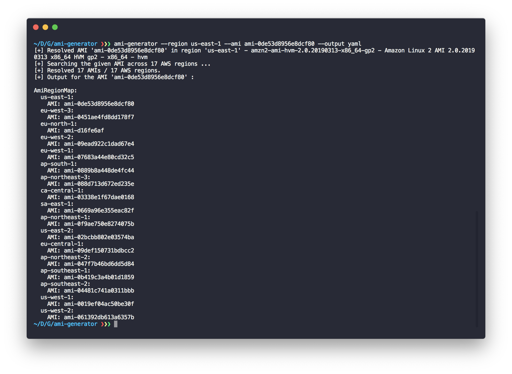

<br /><p align="center">
  
</p><br />

# ami-resolver
> Resolves AMI images available in multiple AWS regions given a base AMI name or identifier.

[](contributing.md)

Current version: **1.0.0**

## 📋 Table of contents

- [Installation](#-install)
- [Features](#-features)
- [Metrics](#-metrics)
- [Description](#-description)
- [Usage](#-usage)
- [See also](#-see-also)

## 🚀 Install

To install the `ami-resolver` command-line tool on your development machine, run the following command :

```bash
npm install --global ami-resolver
```

To verify that the `ami-resolver` has been correctly installed, run the following command.

```bash
$ ami-resolver --version
1.0.0
```

## 🔖 Features

 - Resolves an AMI list based on an AMI name or identifier across all AWS regions.
 - Outputs readily embeddable AMI mappings for your CloudFormation templates.
 - Supports JSON, YAML and Text outputs.
 
## 📊 Metrics

The below metrics displays approximate values associated with deploying and using this block.

Metric | Value
------ | ------
**Type** | Tool
**Installation Time** | Less than 1 minute
**Audience** | Developers, Solutions Architect
**Language** | Node.js

## 🔰 Description

This command-line tool allows you to determine, given an AMI in a specific AWS region, its associated AMIs in the other AWS regions. This is especially useful for developers writing CloudFormation templates deploying EC2 instances that require to create mappings of AMIs for the different regions which the CloudFormation template supports.

This application allows you to create AMI mappings automatically using :

 - A base AMI (e.g `ami-0de53d8956e8dcf80`) in a given AWS region.
 - A base AMI name (e.g `amzn2-ami-hvm-2.0.20190313-x86_64-gp2`) in a given AWS region.

<p align="center">
  
</p>

## 🛠 Usage

### Generate an AMI mapping given a base AMI

In order to generate a mapping of AMIs given a base AMI associated with an AWS region, you can run the following command.

```bash
ami-resolver --region us-east-1 --output yaml --ami ami-0de53d8956e8dcf80
```

Here, the base AMI `ami-0de53d8956e8dcf80` associated with the region `us-east-1` is known, and passing it to `ami-resolver` will generate the the AMI mapping for all the AWS regions.

<details><summary>See the output</summary>
<p>

```yaml
AmiRegionMap:
  us-east-1:
    AMI: ami-0de53d8956e8dcf80
  eu-west-3:
    AMI: ami-0451ae4fd8dd178f7
  eu-north-1:
    AMI: ami-d16fe6af
  eu-west-2:
    AMI: ami-09ead922c1dad67e4
  eu-west-1:
    AMI: ami-07683a44e80cd32c5
  ca-central-1:
    AMI: ami-03338e1f67dae0168
  ap-south-1:
    AMI: ami-0889b8a448de4fc44
  sa-east-1:
    AMI: ami-0669a96e355eac82f
  ap-northeast-1:
    AMI: ami-0f9ae750e8274075b
  ap-northeast-3:
    AMI: ami-088d713d672ed235e
  us-east-2:
    AMI: ami-02bcbb802e03574ba
  eu-central-1:
    AMI: ami-09def150731bdbcc2
  ap-northeast-2:
    AMI: ami-047f7b46bd6dd5d84
  ap-southeast-1:
    AMI: ami-0b419c3a4b01d1859
  ap-southeast-2:
    AMI: ami-04481c741a0311bbb
  us-west-1:
    AMI: ami-0019ef04ac50be30f
  us-west-2:
    AMI: ami-061392db613a6357b
```

</p>
</details>

### Generate an AMI mapping given a base AMI name

In order to generate a mapping of AMIs given an AMI name associated with an AWS region, you can run the following command.

```bash
ami-resolver --region us-east-1 --output yaml --ami-name amzn2-ami-hvm-2.0.20190313-x86_64-gp2
```

Here, the AMI name `amzn2-ami-hvm-2.0.20190313-x86_64-gp2` associated with the region `us-east-1` is known, and passing it to `ami-resolver` will generate the the AMI mapping for all the AWS regions.

<details><summary>See the output</summary>
<p>

```yaml
AmiRegionMap:
  us-east-1:
    AMI: ami-0de53d8956e8dcf80
  eu-west-3:
    AMI: ami-0451ae4fd8dd178f7
  eu-north-1:
    AMI: ami-d16fe6af
  eu-west-2:
    AMI: ami-09ead922c1dad67e4
  eu-west-1:
    AMI: ami-07683a44e80cd32c5
  ca-central-1:
    AMI: ami-03338e1f67dae0168
  ap-south-1:
    AMI: ami-0889b8a448de4fc44
  sa-east-1:
    AMI: ami-0669a96e355eac82f
  ap-northeast-1:
    AMI: ami-0f9ae750e8274075b
  ap-northeast-3:
    AMI: ami-088d713d672ed235e
  us-east-2:
    AMI: ami-02bcbb802e03574ba
  eu-central-1:
    AMI: ami-09def150731bdbcc2
  ap-northeast-2:
    AMI: ami-047f7b46bd6dd5d84
  ap-southeast-1:
    AMI: ami-0b419c3a4b01d1859
  ap-southeast-2:
    AMI: ami-04481c741a0311bbb
  us-west-1:
    AMI: ami-0019ef04ac50be30f
  us-west-2:
    AMI: ami-061392db613a6357b
```

</p>
</details>

### Changing the mapping output

The `ami-resolver` command-line tool supports different ways to output the AMI mapping :

 - **Json** **-** Creates a CloudFormation compatible AMI mapping in the JSON format.
 - **Yaml** **-** Creates a CloudFormation compatible AMI mapping in the YAML format.
 - **Text** **-** Creates a textual output of the AMI mapping (this is the default choice when the `--output` option is not specified).
 
#### JSON Output

<details><summary>See the output</summary>
<p>

```json
{
  "AmiRegionMap": {
    "us-east-1": {
      "AMI": "ami-0de53d8956e8dcf80"
    },
    "eu-west-3": {
      "AMI": "ami-0451ae4fd8dd178f7"
    },
    "eu-north-1": {
      "AMI": "ami-d16fe6af"
    },
    "eu-west-2": {
      "AMI": "ami-09ead922c1dad67e4"
    },
    "eu-west-1": {
      "AMI": "ami-07683a44e80cd32c5"
    },
    "ap-south-1": {
      "AMI": "ami-0889b8a448de4fc44"
    },
    "ap-northeast-3": {
      "AMI": "ami-088d713d672ed235e"
    },
    "ca-central-1": {
      "AMI": "ami-03338e1f67dae0168"
    },
    "sa-east-1": {
      "AMI": "ami-0669a96e355eac82f"
    },
    "ap-northeast-1": {
      "AMI": "ami-0f9ae750e8274075b"
    },
    "us-east-2": {
      "AMI": "ami-02bcbb802e03574ba"
    },
    "eu-central-1": {
      "AMI": "ami-09def150731bdbcc2"
    },
    "ap-northeast-2": {
      "AMI": "ami-047f7b46bd6dd5d84"
    },
    "ap-southeast-1": {
      "AMI": "ami-0b419c3a4b01d1859"
    },
    "us-west-1": {
      "AMI": "ami-0019ef04ac50be30f"
    },
    "ap-southeast-2": {
      "AMI": "ami-04481c741a0311bbb"
    },
    "us-west-2": {
      "AMI": "ami-061392db613a6357b"
    }
  }
}
```

</p>
</details>

#### YAML Output

```bash
ami-resolver --region us-east-1 --output yaml --ami ami-0de53d8956e8dcf80
```

<details><summary>See the output</summary>
<p>

```yaml
AmiRegionMap:
  us-east-1:
    AMI: ami-0de53d8956e8dcf80
  eu-west-3:
    AMI: ami-0451ae4fd8dd178f7
  eu-north-1:
    AMI: ami-d16fe6af
  eu-west-2:
    AMI: ami-09ead922c1dad67e4
  eu-west-1:
    AMI: ami-07683a44e80cd32c5
  ca-central-1:
    AMI: ami-03338e1f67dae0168
  ap-south-1:
    AMI: ami-0889b8a448de4fc44
  sa-east-1:
    AMI: ami-0669a96e355eac82f
  ap-northeast-1:
    AMI: ami-0f9ae750e8274075b
  ap-northeast-3:
    AMI: ami-088d713d672ed235e
  us-east-2:
    AMI: ami-02bcbb802e03574ba
  eu-central-1:
    AMI: ami-09def150731bdbcc2
  ap-northeast-2:
    AMI: ami-047f7b46bd6dd5d84
  ap-southeast-1:
    AMI: ami-0b419c3a4b01d1859
  ap-southeast-2:
    AMI: ami-04481c741a0311bbb
  us-west-1:
    AMI: ami-0019ef04ac50be30f
  us-west-2:
    AMI: ami-061392db613a6357b
```

</p>
</details>

#### Text Output

```bash
ami-resolver --region us-east-1 --output text --ami ami-0de53d8956e8dcf80
```

<details><summary>See the output</summary>
<p>

```text
Region us-east-1 - ami-0de53d8956e8dcf80
Region eu-west-3 - ami-0451ae4fd8dd178f7
Region eu-north-1 - ami-d16fe6af
Region eu-west-2 - ami-09ead922c1dad67e4
Region eu-west-1 - ami-07683a44e80cd32c5
Region ap-south-1 - ami-0889b8a448de4fc44
Region ca-central-1 - ami-03338e1f67dae0168
Region sa-east-1 - ami-0669a96e355eac82f
Region ap-northeast-3 - ami-088d713d672ed235e
Region ap-northeast-1 - ami-0f9ae750e8274075b
Region us-east-2 - ami-02bcbb802e03574ba
Region eu-central-1 - ami-09def150731bdbcc2
Region ap-northeast-2 - ami-047f7b46bd6dd5d84
Region ap-southeast-1 - ami-0b419c3a4b01d1859
Region us-west-1 - ami-0019ef04ac50be30f
Region ap-southeast-2 - ami-04481c741a0311bbb
Region us-west-2 - ami-061392db613a6357b
```

</p>
</details>

> Note that the `--output` option can be used whether you are generating an AMI mapping given an AMI or an AMI name.

## 👀 See also

 - The [`describeImages`](https://docs.aws.amazon.com/AWSJavaScriptSDK/latest/AWS/EC2.html#describeImages-property) API.
 
